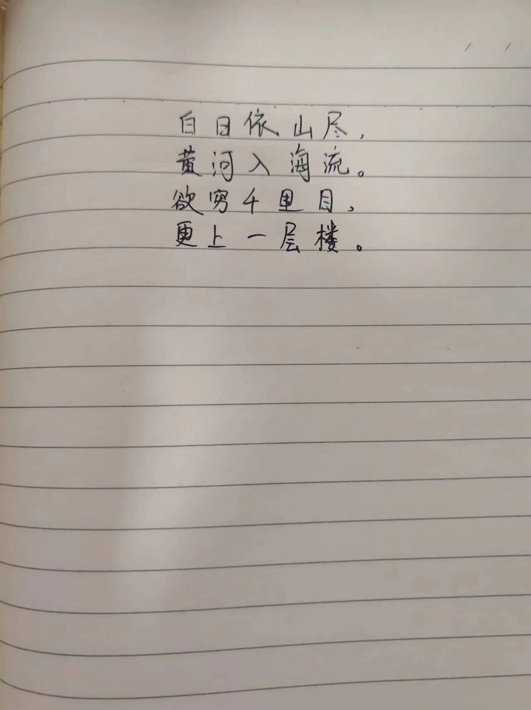
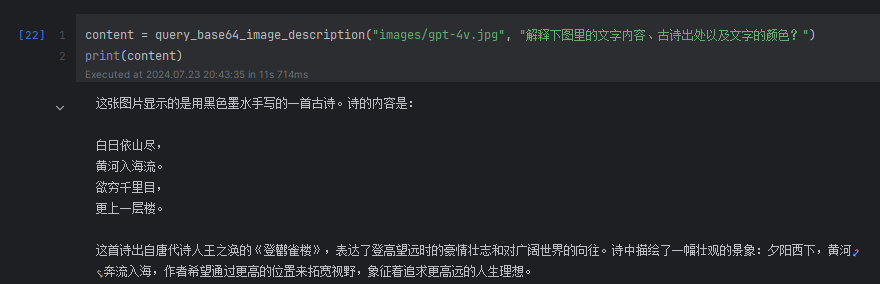
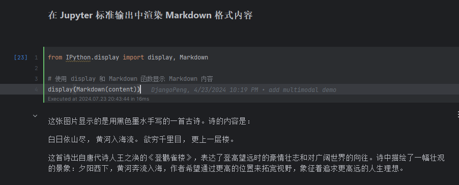
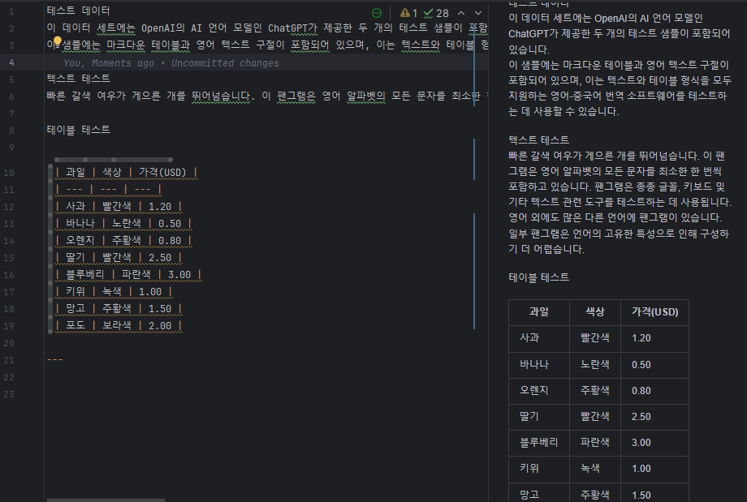
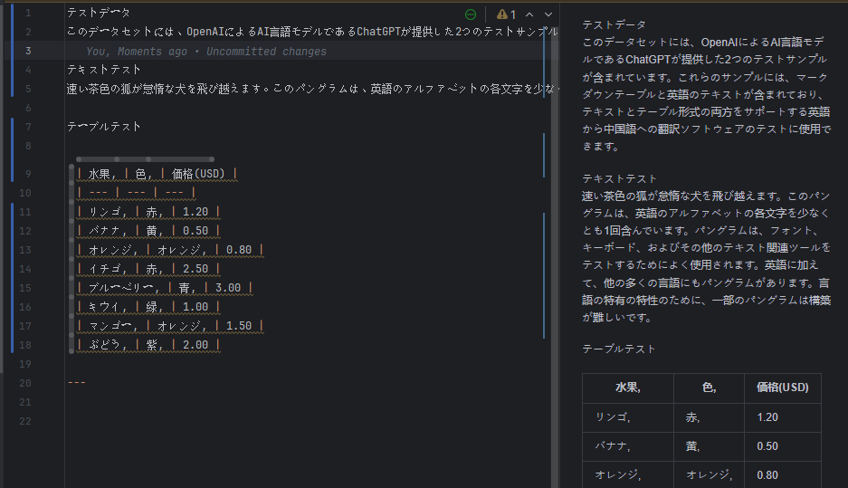

# 作业
### Day1: 总结：[7-22 homework.json](7-22%20homework.json)
### Day2：see commit details
1. GPT-4V的使用
   1.1 上传自己手写的图片到images文件夹，可命名为gpt-4v.jpg；
   1.2 修改query_base64_image_description的方法描述，分析gpt-4v.jpg图片；
   1.3 输出分析结果，并使用函数对输出进行渲染，渲染成Markdown格式使结果更易读；
2. ai translator的使用
   2.1 ai translator中，添加2种以上的其他语言对翻译

3. 扩展langchain chains
   3.1 扩展chains，使其支持生物、计算机和汉语文学老师等学科的提示词模板及对应 Chains问答。
[router_chain.ipynb](langchain/jupyter/chains/router_chain.ipynb)